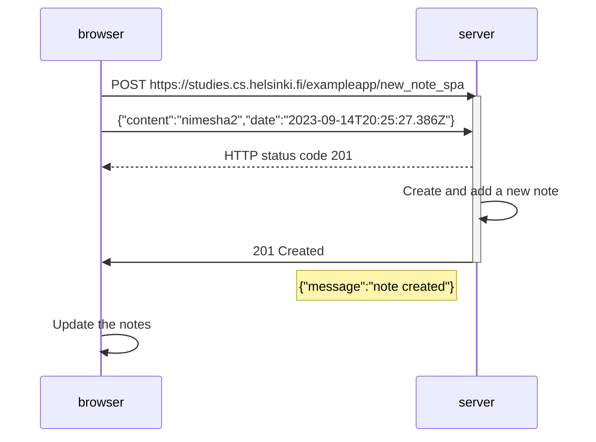

```mermaid
sequenceDiagram
participant browser
participant server
    browser->>server: POST https://studies.cs.helsinki.fi/exampleapp/new_note_spa
    activate server
    browser->>server: {"content":"nimesha2","date":"2023-09-14T20:25:27.386Z"}
    server-->>browser: HTTP status code 201

    server->>server: Create and add a new note 

    server->>browser: 201 Created
    deactivate server

    Note left of server: {"message":"note created"}

    browser->>browser: Update the notes 

```
